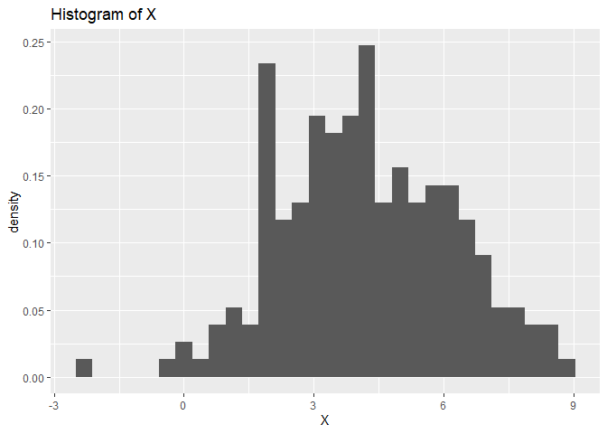

Lab 1 - pierwszy raport statystyczny
================
Dzmitry Navumau
February, 2024

**Zadanie 1.**

``` r
data(iris)
#help(iris)
View(iris)
plot(iris$Sepal.Length, iris$Sepal.Width, pch=19, col=iris$Species)
legend('topright', legend=levels(iris$Species), fill=1:3)
```

<!-- -->

``` r
#help(mean)
tapply(iris$Sepal.Length, iris$Species, mean)
```

    ##     setosa versicolor  virginica 
    ##      5.006      5.936      6.588

**Zadanie 2.** Dołączamy do danych `iris` nową kolumnę o nazwie
`Sepal.Area`, równą iloczynowi kolumn `Sepal.Length` oraz `Sepal.Width`.

``` r
iris$Sepal.Area <- iris$Sepal.Length * iris$Sepal.Width
```

**Zadanie 3.** Tworzymy wektor kolejnych liczb naturalnych od 1 do 1000
włącznie.

``` r
numbers <- 1:1000
```

mnożymy każdy element przez 2.

``` r
numbers <- numbers * 2
```

Zmieniamy co piąty element na 0

``` r
numbers[seq(5, length(numbers), by = 5)] <- 0
```

Dodaj elementy -2, -1 na początku wektora oraz 2001, 2002 na końcu.

``` r
numbers <- c(-2, -1, numbers, 2001, 2002)
length(numbers)
```

    ## [1] 1004

**Zadanie 4.** Ladujemy dane o nazwie `DNase`, wybieramy co drugi wiersz
tabeli.

``` r
data(DNase, package = "datasets")
filtered_DNase <- DNase[seq(1, nrow(DNase), by = 2), ]
```

Przedstaw zależność zmiennej `density` od zmiennej `conc` na wykresie
liniowym.

``` r
library(ggplot2)
ggplot(filtered_DNase, aes(x = conc, y = density, colour = factor(Run))) +
  geom_line() +
  geom_point(shape = 19) +
  labs(colour = "Run")
```

<!-- -->

**Zadanie 5(dodatkowe).** Tworzymy wektor `X` zawierający 200 obserwacji
wylosowanych z rozkładu normalnego z parametrami `mean=4`, `sd=2`.
Przekształcamy wylosowany wektor w ramkę danych:

``` r
X <- rnorm(200, mean = 4, sd = 2)
X <- data.frame(X)
```

Zwizualizujmy wygenerowane dane na histogramie:

``` r
histogram <- ggplot(X, aes(x = X, y = ..density..)) +
  geom_histogram() +
  labs(title = "Histogram of X", x = "X", y = "density")
histogram
```

    ## `stat_bin()` using `bins = 30`. Pick better value with `binwidth`.

<!-- -->

``` r
x <- seq(-5, 15, by = 0.2)
y <- dnorm(x, 4, 2)
d <- data.frame(x, y)

histogram_vs_gestosc <- histogram + geom_line(aes(x = x, y = y), data=d)
histogram_vs_gestosc
```

    ## `stat_bin()` using `bins = 30`. Pick better value with `binwidth`.

<!-- -->
