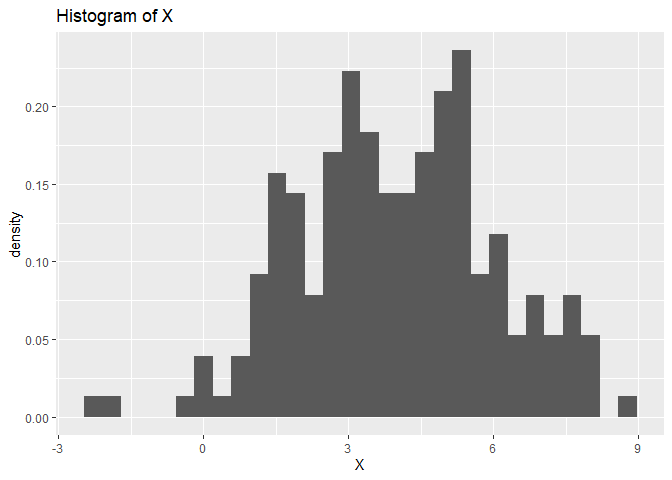

Lab 1 - pierwszy raport statystyczny
================
Dzmitry Navumau
February, 2024

Na dzisiejszych zajęciach zapoznamy się ze środowiskiem
[Rstudio](https://rstudio.com/) oraz przygotujemy nasz pierwszy raport
statystyczny z użyciem pakietu
[Rmarkdown](https://rmarkdown.rstudio.com/).

## Rstudio

Uruchom program Rstudio. Jeśli korzystasz z własnego komputera,
zainstaluj Rstudio korzystając z linka podanego powyżej. Na komputerach
w laboratorium jest już zainstalowny.

Rstudio jest zintegrowanym środowiskiem programistycznym (*integrated
development environment, IDE*) służącym do przeprowadzania analiz
statystycznych i tworzenia grafiki naukowej przy pomocy pakietu R.


Środowisko Rstudio składa się z następujących paneli:

- *Edytor*, służący do pisania skryptów,
- *Konsola*, służąca do wywoływania pojedyńczych poleceń,
- *Lista zmiennych* utworzonych przez użytkownika,
- Panel z wykresami.

W zakładkach znajdują się dodatkowe okna, m.in. historia wywołanych
poleceń i dokumentacja funkcji i pakietów.

**Zadanie 1.** Utwórz nowy skrypt (*File -\> New File -\> R Script*) i
zapisz go w wybranym katalogu. Następnie wklej do niego wymienione
poniżej komendy (każdą w osobnej linijce), wywołaj je po kolei i
przyjrzyj się wynikom. Pojedynczą linijkę skryptu możesz wywołać w
konsoli wciskając `Ctrl+Enter`, a cały skrypt klikajac przycisk `Source`
w prawym górnym rogu okna edytora. Dokładne działanie poszczególnych
komend zostanie opisane w dalszej części kursu.

- `data(iris)`, ładuje do pamięci dane o nazwie `iris`. Jest to jeden ze
  zbiorów danych które są dołączone do pakietu R. Zawiera pomiary
  kwiatów należących do trzech gatunków rodzaju *Iris* (pol. irys).
- `help(iris)`, wyświetla informacje na temat danych `iris`.
- `View(iris)`, wyświetla dane w oknie edytora.
- `plot(iris$Sepal.Length, iris$Sepal.Width, pch=19, col=iris$Species)`,
  wykreśla zależność szerokości od długości płatków irysa i koloruje
  punkty w zależności od gatunku rośliny.
- `legend('topright', legend=levels(iris$Species), fill=1:3)`, dodaje
  legendę do wykresu.
- `help(mean)`, wyświetla dokumentację funkcji `mean`.
- `tapply(iris$Sepal.Length, iris$Species, mean)`, oblicza średnią
  długość płatka dla każdego gatunku. Na razie nie musicie przejmować
  się tym, jak dokładnie działa komenda `tapply()` - zostanie to
  wyjaśnione w przyszłym tygodniu. Ogólnie rzecz biorąc służy ona do
  przyłożenia jakiejś funkcji, na przykład `mean()`, do kilku grup
  obserwacji jednocześnie.

Teraz wywołaj w konsoli komendę `install.packages('tidyverse')`, która
zainstaluje pakiet o nazwie `tidyverse`, rozszerzający podstawową
funkcjonalność R. Instalacja może trochę potrwać. W tym czasie możesz
przeczytać poniższą czytankę.

**Rozwiązanie zadania 1: **

``` r
data(iris)
help(iris)
View(iris)
plot(iris$Sepal.Length, iris$Sepal.Width, pch=19, col=iris$Species)
legend('topright', legend=levels(iris$Species), fill=1:3)
```

<!-- -->

``` r
help(mean)
tapply(iris$Sepal.Length, iris$Species, mean)
```

    ##     setosa versicolor  virginica 
    ##      5.006      5.936      6.588

## Co to R i po co to?

R jest jednym z najpopularniejszych programów do analizy danych (obok
SAS, Microsoft Excel i języka Python). Jego główną zaletą jest to, że
jest mocno przystosowany do szybkiego przeprowadzania prostych analiz z
użyciem gotowych pakietów.

Przystosowanie do konkretnego zadania oznacza jednocześnie, że R idzie
na przekór większości konwencji spotykanych w innych językach
programowania. Z tego powodu, o ile R jest bardzo wygodnym narzędziem do
przeprowadzania rutynowych analiz, to implementowanie własnych
algorytmów w R jest bardzo uciążliwe i mało wydajne obliczeniowo. Na
kursie Statystycznej Analizy Danych nie będziemy prawie nigdy pisać
własnych programów - niemal wszystkie zadania da się rozwiązać
korzystając z gotowych funkcji i pakietów, które na ogół są napisane w
językach FORTRAN lub C.

Głównym konkurentem R jest język Python. Oba narzędzia oferują
komplementarne możliwości. O ile R jest wyspecjalizowanym pakietem
statystycznym, to język Python jest językiem ogólnego zastosowania. Z
tego powodu dużo lepiej nadaje się do implementowania własnych,
niestandardowych rozwiązań. Jest również dużo bardziej wydajny
obliczeniowo - kod napisany w tym języku wywołuje się
kilku(dziesięcio)krotnie szybciej niż analogiczny kod napisany w R. Z
drugiej strony, przeprowadzenie typowej analizy i przygotowanie raportu
statystycznego zajmuje w nim kilku(dziesięcio)krotnie więcej czasu.

Zarówno R jak i Python są powszechnie używane w analizie danych i każdy,
kto planuje w przyszłości pracować z danymi, powinien poznać oba te
narzędzia przynajmniej w podstawowym stopniu i wiedzieć, kiedy stosować
każde z nich.

## Raporty statystyczne w Rmarkdown

Rmarkdown Notebook służy do łączenia kodu w R z tekstem w języku
naturalnym oraz wzorami w języku $\LaTeX$.

Komórki z kodem w R zaczynają się od trzech apostrofów (chodzi o tzw.
*backticks*, czyli te na klawiszu z tyldą) i litery r w nawiasach
klamrowych, a kończą trzema apostrofami.  
Pominięcie litery r oznacza wyróżnioną komórkę z tekstem,

    taką jak ta.

**Zadanie 2.** Utwórz nowy notatnik markdown z domyślnymi ustawieniami
(*File -\> New File -\> R Markdown*) i zapisz go w wybranym katalogu.
Utwórz nową komórkę z kodem w R i wklej do niej następujące komendy:

- `data(iris)`
- `head(iris)`, wyświetla kilka pierwszych wierszy tabeli `iris`.

Utwórz kolejną komórkę z kodem i wklej do niej wybrane komendy z
Zadania 1. Skompiluj notatnik (przycisk `Knit` na górze okna edytora) i
obejrzyj wynik.  
Jeśli pakiet `rmarkdown` nie jest zainstalowny, to powinien zainstalować
się automatycznie. Może to trochę potrwać. W tym czasie możesz zapoznać
się ze składnią języka Markdown korzystając z [tej
ściągawki](https://rstudio.com/wp-content/uploads/2015/02/rmarkdown-cheatsheet.pdf)
lub dowolnych innych materiałów wyszukanych samodzielnie w internecie.

## Obsługa danych w R

Podstawowym typem danych w R jest tzw. `data frame`, czyli **ramka
danych**. Przykładem takiej zmiennej są dane `iris`. Poszczególne
komórki wybieramy za pomocą nawiasów kwadratowych:

- `x <- iris[1,2]` przypisuje zmiennej `x` wartość z pierwszego wiersza
  i drugiej kolumny. Uwaga: w przeciwieństwie do wielu języków
  programowania, w R numerację zaczynamy od 1, a nie od 0.
- `x <- iris[1,]` przypisuje zmiennej `x` pierwszy wiersz.
- `x <- iris[,1]` przypisuje pierwszą kolumnę.
- `x <- iris$Sepal.Length` przypisuje kolumnę o nazwie `Sepal.Length`.
  Uwaga: nie stosujemy cudzysłowu przy nazwie kolumny.

Analogicznie przypisujemy wartości do komórek, wierszy lub kolumn:

- `iris[1,2] <- 1` przypisze $1$ do komórki w pierwszym wierszu i
  drugiej kolumnie
- `iris$New_column <- 2` utworzy nową kolumnę o nazwie `New_column`,
  wypełnioną dwójkami.

Liczby wierszy i kolumn tabeli są wyświetlone w oknie z listą zmiennych.
Możemy również sprawdzić je za pomocą komend `nrow` oraz `ncol`. Nazwy
kolumn możemy sprawdzić komendą `colnames()`.

Kolejny ważny typ danych to **wektor liczb zmiennoprzecinkowych**.  
Przykładem takich wektorów są pierwsze cztery kolumny danych `iris`.  
Nowy wektor długości $n$ wypełniony zerami tworzymy komendą
`x <- numeric(n)`.  
Kilka wektorów $x_1, x_2, x_3$ łączymy w nowy wektor $y$ za pomocą
komendy `c()` (skrót od *concatenate*): `y <- c(x1, x2, x3)`.  
Długość wektora $x$ sprawdzamy komendą `length(x)`.  
Wektory można do siebie dodawać: `z <- x+y` oraz mnożyć: `z <- x*y`.  
Mnożenie odbywa się po współrzędnych.

**Zadanie 3.** Dołącz do danych `iris` nową kolumnę o nazwie
`Sepal.Area`, równą iloczynowi kolumn `Sepal.Length` oraz `Sepal.Width`.
**Rozwiazanie Zadania 3: **

``` r
iris$Sepal.Area <- iris$Sepal.Length * iris$Sepal.Width
```

Innym typem wektora jest **wektor całkowitoliczbowy**.  
Wektor złożony z kolejnych liczb całkowitych od $n$ do $m$ (włącznie)
tworzymy następująco: `x <- n:m`.  
Tego typu wektor możemy wykorzystać do wybrania kilku wierszy tabeli:
`x <- iris[5:10, ]`.  
Jeśli chcemy wybrać kilka fragmentów tabeli, możemy wykorzystać komendę
`c()`.  
Na przykład, `x <- iris[c(1:10, 20:30), ]` przypisze do zmiennej `x`
nową ramkę danych, złożoną z wierszy o numerach od 1 do 10 oraz od 20 do
30.

**Zadanie 4.** Utwórz wektor kolejnych liczb naturalnych od 1 do 1000
włącznie. Następnie:

- Pomnóż każdy element przez 2.
- Zmień co piąty element na 0, korzystając z operatora `:` i działań
  arytmetycznych.
- Dodaj elementy -2, -1 na początku wektora oraz 2001, 2002 na końcu.
- Sprawdź długość nowego wektora.

**Rozwiazanie zadania 4: **

``` r
numbers <- 1:1000
numbers <- numbers * 2
numbers[seq(5, length(numbers), by = 5)] <- 0
numbers <- c(-2, -1, numbers, 2001, 2002)
length(numbers)
```

    ## [1] 1004

Bardziej złożone sekwencje liczb możemy tworzyć komendą `seq()`.  
Jej działanie możesz sprawdzić wpisując w konsolę komendę `help(seq)`.
Wyświetli ona dokumentację funkcji `seq` w miejscu panelu z wykresami.

Kolejnym ważnym typem zmiennej jest typ ***factor***, czyli tzw. typ
wyliczeniowy. Jest to wektor obserwacji z ustalonego zbioru wartości,
tzw. poziomów.  
Przykładem takiej zmiennej jest piąta kolumna tabeli `iris`.  
Jest to factor o trzech poziomach: `setosa`, `versicolor` oraz
`virginica`.  
Ważną cechą factorów jest to, że pamiętają, jakiego typu poziomy mogą w
nich wystąpić.  
Widać to na przykład po wybraniu pierwszych trzech wierszy z kolumny
`Species`:

``` r
trzy_poziomy <- iris[1:3,5]
trzy_poziomy
```

    ## [1] setosa setosa setosa
    ## Levels: setosa versicolor virginica

Pomimo tego, że w nowym wektorze występują jedynie gatunki `setosa`,
zmienna `trzy_poziomy` nadal pamięta pierwotny zbiór gatunków Jak się
niedługo okaże, jest to niezwykle pomocne w analizie danych.

R posiada jeszcze kilka typów zmiennych, które, w zależności od potrzeb,
będą pojawiać się na kolejnych zajęciach.

## Biblioteka ggplot2

Biblioteka `ggplot2` służy do przygotowywania grafiki naukowej w R, i
jest jedną z najmocniejszych stron tego języka. Wszystkie wykresy na SAD
powinniście przygotowywać z użyciem tej biblioteki. Przed użyciem
bibliotekę należy załadować używając komendy `library(ggplot2)`.

Sposób przygotowywania wykresów z użyciem ggplot2 jest dość nietypowy,
ale stosunkowo intuicyjny. Na początku tworzymy pusty wykres komendą
`ggplot()`. Na tym etapie możemy od razu określić, z jakich danych
chcemy korzystać, pisząc np. `ggplot(iris)`.  
Dane muszą być typu ***data frame***. Jest to (niemalże) jedyny typ
danych obsługiwany przez tę bibliotekę.  
Częstym źródłem błędów przy obsłudze biblioteki ggplot2 jest próba
stworzenia wykresu z wektorów liczb zmiennoprzecinkowych.

Na pusty wykres nakładamy kolejne warstwy, takie jak wykres punktowy,
liniowy, histogram itd. Każdą taką warstwę tworzymy osobną komendą,
zaczynającą się na ogół od `geom` lub od `stat`. Na przykład,
`geom_point()` to warstwa zawierająca wykres punktowy. Wszystkie
geometrie (czyli typy wykresów) są opisane w dokumentacji pakietu
`ggplot2` na [tej stronie](https://ggplot2.tidyverse.org/reference/).

Dodanie nowej warstwy do pustego wykresu wykonujemy poprzez dodanie
nowej warstwy do pustego wykresu: `ggplot() + geom_point()`.  
Na końcu musimy jeszcze określić, co konkretnie chcemy wykreślić na
wykresie. W `ggplot2` robimy to za pomocą tzw. *estetyk* (*aesthetics*),
które określają, w jaki sposób dane mają być przekształcone na własności
wizualne na wykresie. Estetyki określają m.in. położenie na osi x i na
osi y, kolor, rozmiar i wypełnienie punktów. Możemy określić je
globalnie, w funkcji `ggplot()`, lub dla każdej warstwy z osobna.

Zależność szerokości od długości płatków irysów możemy przedstawić na
wykresie punktowym w następujący sposób:

``` r
ggplot(iris) + geom_point(aes(x=Sepal.Length, y=Sepal.Width, col=Species))
```

<!-- --> Ważne jest,
żeby pamiętać, że w estetykach podajemy nazwy zmiennych bez cudzysłowu.
Kolor punktów określamy podając estetykę `col`, w której wystarczy
określić, do jakiej grupy należy każda obserwacja. Kolory zostaną
dobrane automatycznie.

Dane, z jakich tworzymy wykres, możemy określić albo w funkcji
`ggplot()`, albo bezpośrednio w geometrii, na przykład tak:

``` r
ggplot() + geom_point(aes(x=Sepal.Length, y=Sepal.Width, col=Species), data=iris)
```

Żeby zmodyfikować ogólny wygląd wykresu, możemy na końcu dodać tzw.
*temat* (ang. *theme*). Do grafiki naukowej szczególnie nadaje się
`theme_minimal()`:

``` r
ggplot(iris) + geom_point(aes(x=Sepal.Length, y=Sepal.Width, col=Species)) + theme_minimal()
```

<!-- -->

**Zadanie 5.** Utwórz nową kolumnę z kodem w R w notatniku z
poprzedniego zadania. Załaduj dane o nazwie `DNase`. Wybierz co drugi
wiersz tabeli. Korzystając z biblioteki `ggplot2` oraz geometrii
`geom_line`, przedstaw zależność zmiennej `density` od zmiennej `conc`
na wykresie liniowym. Dodaj kolejną warstwę z wykresem punktowym
obrazującym tę zależność. Zmodyfikuj kształt punktów w wybrany przez
siebie sposób (patrz
[dokumentacja](https://ggplot2.tidyverse.org/reference/geom_point.html)
funkcji geom_point).

**Rozwiązanie zadanie 5: **

``` r
data(DNase, package = "datasets")
filtered_DNase <- DNase[seq(1, nrow(DNase), by = 2), ]

ggplot(filtered_DNase, aes(x = conc, y = density, colour = factor(Run))) +
  geom_line() +
  geom_point(shape = 19) +
  labs(colour = "Run")
```

<!-- -->

**Uwaga dotycząca funkcji qplot.** Szukając informacji dotyczących
biblioteki ggplot2 w internecie możecie natrafić na funkcję `qplot`.
Jest to funkcja służąca do szybkiego tworzenia prostych wykresów. Sposób
użycia tej funkcji jest jednak zupełnie inny niż w przypadku
standardowych funkcji z biblioteki ggplot2, dlatego na razie nie
będziemy z niej korzystać.

## Zadania dodatkowe

**Zadanie 1.** Funkcja `rnorm()` służy do losowania obserwacji z
rozkładu normalnego. Wywołanie komendy `help(rnorm)` wyświetli jej
dokumentację, wraz z opisem kilku innych funkcji związanych z rozkładem
normalnym. Celem tego zadania jest porównanie gęstości rozkładu
normalnego z histogramem wylosowanych wartości.

- Utwórz wektor `X` zawierający 200 obserwacji wylosowanych z rozkładu
  normalnego z parametrami `mean=4`, `sd=2`.
- Przekształć wylosowany wektor w ramkę danych: `X <- data.frame(X)`.
- Utwórz histogram wylosowanych wartości korzystając z biblioteki
  ggplot2 i geometrii `geom_histogram`. Dokumentację i przykłady
  zastosowania tej geometrii wyszukaj w internecie. Co znajduje się na
  osi OY utworzonego wykresu?
- Spraw, żeby na osi OY znalazła się częstość występowania danej
  wartości. Można to zrobić wykorzystując specjalną estetykę:
  `aes(y=..density..)`.
- Utwórz wektor zmiennoprzecinkowy `x`, zawierający ciąg liczb od -5 do
  15 z odstępem 0.2 (tak, żeby długość wektora `x` wynosiła 101). Możesz
  wykorzystać funkcję `seq`.
- Utwórz wektor `y`, zawierający wartość gęstości rozkładu normalnego z
  parametrami `mean=4`, `sd=2` w punktach wektora `x`:
  `y <- dnorm(x, 4, 2)`. Większość funkcji w R, w tym `dnorm`, przyjmuje
  jako argument całe wektory i zwraca wynik obliczony dla każdego
  elementu wektora.
- Połącz wektory `x` i `y` w jedną ramkę danych o nazwie `d`.
- Do histogramu utworzonego w poprzednich punktach dodaj warstwę
  zawierającą wykres liniowy obrazujący obliczoną gęstość. Pamiętaj, że
  dane do stworzenia nowej warstwy możesz podać bezpośrednio w
  geometrii: `geom_line(aes(...), data=d)`.

**Rozwiązanie zadania 1.**

``` r
help(rnorm)
X <- rnorm(200, mean = 4, sd = 2)
X <- data.frame(X)

histogram <- ggplot(X, aes(x = X, y = ..density..)) +
  geom_histogram() +
  labs(title = "Histogram of X", x = "X", y = "density")
histogram
```

    ## `stat_bin()` using `bins = 30`. Pick better value with `binwidth`.

<!-- -->

``` r
x <- seq(-5, 15, by = 0.2)
y <- dnorm(x, 4, 2)
d <- data.frame(x, y)


histogram_vs_gestosc <- histogram + geom_line(aes(x = x, y = y), data=d)
histogram_vs_gestosc
```

    ## `stat_bin()` using `bins = 30`. Pick better value with `binwidth`.

<!-- -->

Wywołaj swój kod kilkukrotnie i zobacz, w jaki sposób zmienia się
histogram.  
Wypróbuj również kilka wartości parametrów `mean` oraz `sd`.
